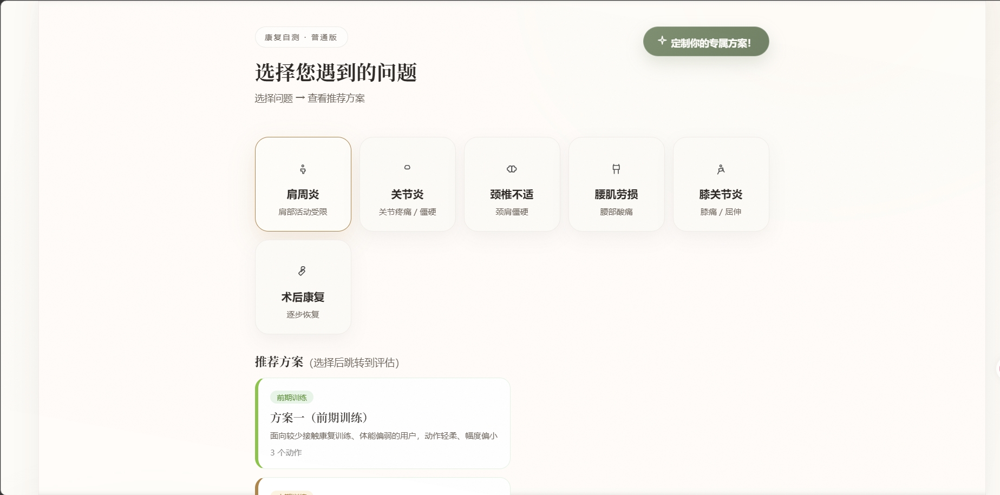

# MoonWave 月波康复

> 一个 AI 运动康复指导系统：**浏览器端做姿态估计**，后端做关节角度判定、评分与时序评估，并提供动作库与分阶段康复方案。

MoonWave（月波康复）是一个全栈的「AI 运动康复指导」Web 应用。面向康复训练场景，用户在浏览器里对着摄像头做动作，系统实时识别姿态、判定动作是否标准、给出评分与反馈，并按「症状 → 早/中/后期三套方案」引导训练。

> ⚠️ **免责声明**：本项目仅用于**技术学习与研究**，**不构成任何医疗建议或诊断**。动作标准角度区间为示例数据，未经临床验证。如有伤病，请先咨询专业医师/治疗师再使用。详见 [免责声明](#免责声明)。

---

## 功能

- **实时姿态评估**：浏览器本地做姿态估计（MediaPipe PoseLandmarker），只上传 33 个归一化关键点；后端算关节角度、对照标准区间评分、给出反馈与建议。
- **图片评估**：上传一张动作图片，服务端推理并评估。
- **康复动作库**：动作的新增 / 编辑 / 删除 / 详情（动作要点、禁忌人群、目标肌群、标准角度区间）。
- **分阶段康复方案**：按症状组织「前期 / 中期 / 后期」三套方案 + 「单独动作」入口，逐动作引导训练。
- **用户系统**：注册 / 登录、Token 鉴权（带过期）、头像与用户名、评估记录（含关节明细与时序相似度）。
- **侧别（患侧）选择**：无左右之分的动作可选患侧，按患侧评分。
- **时序评估**：自研 ALPS 姿态描述子 + 软约束 DTW，衡量动作的时序一致度（见 `alps_lite.py`）。

## 截图

主页：选择遇到的问题 → 该问题的「前期 / 中期 / 后期」三套方案 + 单独动作。



> 更多截图（实时评估、动作库管理、个人中心等）欢迎补充到 `docs/screenshots/`。

## 技术栈

| 层 | 技术 |
|---|---|
| 前端 | 原生 HTML / CSS / JavaScript（单页），MediaPipe Tasks-Vision（自托管） |
| 后端 | FastAPI + Uvicorn，Pydantic |
| 数据库 | MySQL / MariaDB（PyMySQL） |
| 姿态估计 | MediaPipe Pose（浏览器端；服务端为回退方案） |
| 时序算法 | 自研 ALPS 描述子 + DTW（`alps_lite.py`，纯标准库、零依赖） |

## 架构要点

```
浏览器                          服务器
┌─────────────────────┐        ┌──────────────────────────────┐
│ getUserMedia 取流     │        │ FastAPI (127.0.0.1:8000)     │
│ MediaPipe 本地姿态估计 │ 33点   │  /api/pose/analyze_landmarks │  角度计算
│ 本地画骨架           │ ─────▶ │  /api/pose/analyze_frame     │  ALPS / DTW
│ 只上传关键点          │        │  /api/rehab/*  /api/user/*   │  评分 / 判定
└─────────────────────┘        │  /api/action_lib/*           │  动作库 / 方案
                               └──────────────┬───────────────┘
                                              │ PyMySQL
                                        MySQL / MariaDB
```

- **A′ 方案**：把最重的推理放在用户浏览器，只上传 33 个关键点，服务器压力与带宽都很小；带 GPU→CPU 降级。
- **回退链路**：若浏览器端初始化失败，自动回退到「逐帧上传图片 → 服务端推理」。
- **参考模板按用户隔离**：DTW 的参考模板按 `用户::动作` 存储，不跨用户共享。

## 目录结构

```
MoonWave/
├─ zitaishibie.py          # 后端主程序(FastAPI: 鉴权/评估/动作库/方案/静态页)
├─ alps_lite.py            # ALPS 姿态描述子 + DTW 时序评估(纯标准库, 零依赖)
├─ talma_lite_api.py       # TALMA 路由(FastAPI Router)
├─ index.html              # 前端单页应用
├─ login.html              # 登录/注册页
├─ logo1.jpg               # 站点 logo(月牙 + 波浪)
├─ action_seed.json        # 动作种子数据(启动时导入数据库)
├─ rehab_protocols.json    # 康复方案数据(症状 → 三阶段方案 + 单独动作)
├─ test_alps_lite.py       # ALPS / DTW 算法自测
├─ talma_lite_README.md    # 时序模块说明
├─ requirements.txt
├─ mediapipe/              # 前端姿态资产(见 docs/MEDIAPIPE_ASSETS.md)
└─ docs/                   # 部署与第三方资产说明
```

## 快速开始

### 1. 准备数据库
需要一个 MySQL / MariaDB 实例。表结构由程序启动时自动创建；只需先建库与账号：

```sql
CREATE DATABASE rehab_db CHARACTER SET utf8mb4;
CREATE USER 'rehab_user'@'localhost' IDENTIFIED BY '你的数据库密码';
GRANT ALL PRIVILEGES ON rehab_db.* TO 'rehab_user'@'localhost';
FLUSH PRIVILEGES;
```

### 2. 安装依赖

```bash
python -m venv venv
source venv/bin/activate          # Windows: venv\Scripts\activate
pip install -r requirements.txt
```

> ⚠️ `mediapipe` 请使用 **0.10.x**：本项目使用了 `mp.solutions` 接口，`mediapipe 1.x` 已移除该接口。

### 3. 配置环境变量

| 变量 | 说明 | 默认 |
|---|---|---|
| `DB_HOST` | 数据库地址 | `localhost` |
| `DB_USER` | 数据库用户 | `rehab_user` |
| `DB_PASS` | 数据库密码（**必填，无默认值**） | 空 |
| `DB_NAME` | 数据库名 | `rehab_db` |
| `DB_PORT` | 数据库端口 | `3306` |
| `MEDIAPIPE_DISABLE_GPU` | 无 GPU / headless 环境设为 `1` | 未设 |
| `NO_BROWSER` | 设为 `1` 时不自动打开浏览器 | 未设 |
| `CORS_ALLOW_ORIGINS` | 允许的跨域来源，逗号分隔。**默认 `*`（仅便于本地开发）**，生产请收紧为实际域名 | `*` |

示例（Linux / macOS）：

```bash
export DB_PASS='你的数据库密码'
export MEDIAPIPE_DISABLE_GPU=1
export NO_BROWSER=1
# 生产环境收紧跨域来源（示例）：
# export CORS_ALLOW_ORIGINS='https://your-domain.example,https://www.your-domain.example'
```

> ⚠️ 生产环境请务必设置 `CORS_ALLOW_ORIGINS` 为你的实际域名，不要保留 `*`。

### 4. 前端姿态资产（自托管）
浏览器端姿态估计需要 MediaPipe 资产（模型 + wasm）。本仓库已将资产放在 `mediapipe/`，并需由 Web 服务器以正确 MIME 提供；详见 [docs/MEDIAPIPE_ASSETS.md](docs/MEDIAPIPE_ASSETS.md)。

### 5. 启动

```bash
python zitaishibie.py
# 默认访问 http://127.0.0.1:8000/
```

> 请在项目根目录运行：`index.html` / `login.html` / `logo1.jpg` 是按当前工作目录查找的。

生产部署（nginx 反代 + systemd）参见 [docs/DEPLOYMENT.md](docs/DEPLOYMENT.md)。

## 使用说明

1. 打开 `/login.html` 注册并登录。
2. 在主页选择你「遇到的问题」，会看到该问题的三套方案（前期 / 中期 / 后期）与「单独动作」入口。
3. 点击某套方案进入实时评估页：开启摄像头，按方案中的动作逐个训练，页面右侧显示当前动作、进度与评估结果（达标、得分、时序一致度、关节明细、反馈与建议）。
4. 评估完成后可「保存评估记录」，在个人中心查看历史。

## 第三方与许可

- 前端姿态估计依赖 [MediaPipe](https://github.com/google-ai-edge/mediapipe)（Apache-2.0），其模型与 wasm 运行时为第三方资产，版权归 Google 所有，随仓库分发时请遵守其许可证。
- 后端依赖 FastAPI / Uvicorn / PyMySQL / NumPy / Pillow / OpenCV 等，各自遵循其开源许可证，详见 `requirements.txt` 与各项目主页。
- 仓库内的 `logo1.jpg` 为本项目自有素材。

## 免责声明

- 本项目为技术演示与学习用途，**不是医疗器械软件，不提供医疗建议、诊断或治疗**。
- 动作标准角度区间为示例数据，**未经临床验证**，可能不适用于具体患者；请勿据此替代专业康复指导。
- 使用摄像头即表示你知悉并同意对自身姿态数据的处理；请自行评估隐私与合规要求（尤其涉及个人健康信息时）。

## 贡献

欢迎提交 Issue 与 Pull Request，详见 [CONTRIBUTING.md](CONTRIBUTING.md)。

## 许可证

本项目基于 **MIT License** 开源，详见 [LICENSE](LICENSE)。

```
Copyright (c) 2026 changmengyue, Soul965
```

## 致谢

- [MediaPipe](https://github.com/google-ai-edge/mediapipe)
- [FastAPI](https://github.com/fastapi/fastapi)
